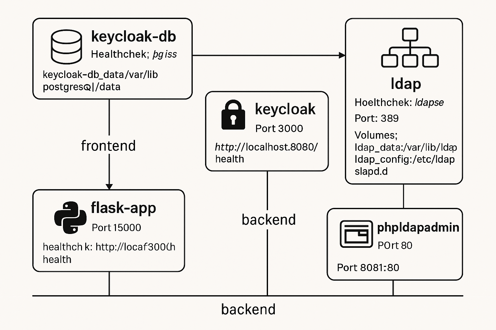

# Application architecture visualized

# Threat Modeling for IAM Architecture using STRIDE

This document outlines potential threats to an Identity and Access Management (IAM) architecture using the STRIDE threat modeling methodology, along with corresponding mitigation strategies and best practices.

Identifying the vulnerabilities, performing threat modeling, and remediating those vulnerabilities follows a systemic approach.
The initial code analysis was performed using Canvas Bandit, a code security tool used for identifying vulnerabilities in Python codebases.
Canvas Bandit works by scanning the codebase for common security vulnerabilities and antipatterns. Docker or image analysis was done using
Docker Scout is a software supply chain security tool that helps to understand and improve the security posture of container images. 
Scout scans the container images for known vulnerabilities or CVEs. Finally, system scanning was performed using Docker Bench for Security, 
a tool automatically auditing Docker installations against industry standards looking for commonly known security misconfigurations.

---

## STRIDE Threat Categories & IAM Context

### 1. Spoofing

* **Threat:** Attackers may impersonate legitimate users or services by stealing credentials or tokens.
* **Context:** Weak authentication mechanisms, insecure token handling (e.g., storing tokens insecurely), or lack of multi-factor authentication (MFA).
* **Example:** An attacker obtains a user's session cookie or JWT and reuses it to access protected resources as the legitimate user.

### 2. Tampering

* **Threat:** Attackers modify tokens or authentication/authorization data either during transmission (in transit) or while it is stored (at rest).
* **Context:** Unsigned or weakly signed tokens (e.g., JWTs without strong digital signatures), lack of HTTPS/TLS for communication channels, or inadequate data integrity checks.
* **Example:** A malicious user alters the payload of a JWT to change their role or permissions before presenting it to the application, or modifies audit logs to hide their actions.

### 3. Repudiation

* **Threat:** Users or services deny having performed actions, making it difficult to prove their involvement due to insufficient logging or non-repudiation controls.
* **Context:** Absence of comprehensive audit trails for authentication and authorization events, lack of cryptographic non-repudiation mechanisms (e.g., digital signatures on actions).
* **Example:** An administrator performs a sensitive action (e.g., deleting user accounts) and later claims they never performed it, with no undeniable record to prove otherwise.

### 4. Information Disclosure

* **Threat:** Sensitive data, such as authentication tokens, cryptographic secrets, user personal information, or internal system details, is unintentionally or maliciously exposed.
* **Context:** Tokens being transmitted in URLs (e.g., query parameters), insecure storage of secrets in code or logs, verbose error messages revealing system internals, or improper logging of sensitive data.
* **Example:** Access tokens are inadvertently leaked via browser history, server logs, or HTTP referer headers. A stack trace in an error message reveals database connection details.

### 5. Denial of Service (DoS)

* **Threat:** Attackers aim to make authentication or authorization services unavailable to legitimate users by overloading endpoints or exhausting system resources.
* **Context:** Absence of rate limiting on authentication endpoints, insufficient resource quotas for services, or lack of effective DDoS mitigation.
* **Example:** Automated bots flood the login endpoint with repeated failed login attempts, consuming server resources and preventing legitimate users from authenticating, or an attacker exhausts token issuance resources.

### 6. Elevation of Privilege

* **Threat:** Attackers gain unauthorized access or higher privileges than they are legitimately entitled to within the system.
* **Context:** Insecure token validation mechanisms (e.g., not verifying token signatures or expiration), improper authorization checks (e.g., authorization logic bugs, confused deputy attacks), or default weak permissions.
* **Example:** A standard user modifies a JWT to bypass signature verification and gain administrative access, or an application incorrectly grants permissions based on a manipulated request.

---

## Mitigation Strategies & Best Practices

To strengthen the security posture of your IAM architecture, consider implementing the following best practices:

### Authentication

* **Strong Password Policies:** Enforce complex password requirements (length, characters, no common patterns).
* **Multi-Factor Authentication (MFA):** Support and encourage/enforce MFA for all user types, especially for privileged accounts.
* **Robust Token Validation:** Always use well-vetted, robust cryptographic libraries to validate tokens. Critically verify:
    * **Signature:** Ensure the token's signature is valid and hasn't been tampered with.
    * **Expiration:** Reject expired tokens.
    * **Audience/Issuer:** Verify the token was issued for the correct audience and by the expected issuer.
* **HTTPS/TLS Everywhere:** Enforce HTTPS/TLS for all authentication and token endpoints. This prevents eavesdropping and tampering during transit.

### Authorization

* **Principle of Least Privilege:** Grant only the minimum permissions necessary for each user, service, or role to perform its function.
* **Centralized Authorization Logic:** Implement authorization logic in a central, consistent manner (e.g., within the IAM system or a dedicated authorization service) to avoid fragmented and inconsistent checks across different applications.
* **Regular Review:** Periodically review and update roles, permissions, and access policies to ensure they remain current and adhere to security requirements.

### Token Management

* **Short Token Expiration:** Set short expiration times for access tokens (e.g., 5-15 minutes for access tokens, longer for refresh tokens). This limits the window of opportunity if a token is compromised.
* **Token Revocation:** Implement mechanisms to immediately invalidate compromised tokens, such as:
    * **Blacklisting:** Maintain a list of revoked tokens.
    * **Session Management:** Link access tokens to sessions that can be terminated.
    * **Key Rotation:** Rotate signing keys regularly to invalidate older tokens (though this is more complex).
* **Secure Secret Storage:** Never hard-code secrets (API keys, database passwords, signing keys) in code or configuration files directly. Use:
    * Environment variables (for simple local deployments).
    * Secret management tools (e.g., Docker Secrets, Kubernetes Secrets, HashiCorp Vault, AWS Secrets Manager) for production.
* **No Sensitive Token Logging:** Do not log sensitive information like raw tokens, client secrets, or user passwords in application logs or system logs.
* **Secure Cookies:** If using session tokens in cookies:
    * Mark them as `HttpOnly` to prevent client-side JavaScript access.
    * Set `Secure` to ensure they are only sent over HTTPS.
    * Use `SameSite=Lax` or `Strict` to mitigate CSRF attacks.

### Audit & Monitoring

* **Comprehensive Logging:** Log all significant authentication and authorization events (e.g., login attempts, token issuance/revocation, privilege changes, access to sensitive resources) with sufficient detail (who, what, when, where, result).
* **Suspicious Activity Monitoring:** Implement monitoring and alerting for:
    * Repeated failed login attempts (potential brute-force).
    * Unusual login locations or times.
    * Excessive token issuance or revocation requests.
    * Unauthorized access attempts.
    * Token replay attempts (if nonces are used).
* **Prompt Investigation:** Have processes in place to investigate and respond to security alerts quickly.

### Other Best Practices

* **Rotate Secrets/Keys:** Regularly rotate all cryptographic keys and sensitive secrets (e.g., API keys, database passwords) to limit the impact of a compromise.
* **Rate Limiting:** Apply rate limiting to all authentication, registration, and token issuance/validation endpoints to mitigate DoS and brute-force attacks.
* **Secure Docker Configuration:**
    * **User-Defined Networks:** Use user-defined Docker networks to isolate services and control communication flow.
    * **Minimal Exposed Ports:** Only expose ports that are absolutely necessary for service communication.
    * **Non-Root Containers:** Run containers as non-root users and minimize their privileges by leveraging user namespaces or specific Docker run flags (e.g., `CAP_DROP_ALL`, `read_only`).

---

**Summary:**

By applying the STRIDE threat modeling methodology to your IAM architecture, you can systematically identify and address potential threats related to authentication, authorization, and token management. Implementing the outlined mitigation strategies and best practices will significantly strengthen your system's overall security posture against a wide range of attacks.

---

#### OAuth 2.0 and OpenID Connect (OIDC) Summary and Flow

**OAuth 2.0 Summary**
OAuth 2.0 is an authorization framework that enables third-party applications to obtain limited access to a user’s resources on a web server without exposing user credentials. It works by issuing access tokens to clients after authenticating the user and obtaining their consent. OAuth 2.0 supports multiple grant types, such as Authorization Code and Implicit, to accommodate different client types and security requirements. Its primary focus is on delegated access rather than authentication.

**OAuth 2.0 Flow Description**
1. The user initiates a login or permission request on the client application.
2. The client redirects the user’s browser to the Authorization Server with a request for access.
3. The user authenticates with the Authorization Server and consents to the requested access.
4. The Authorization Server redirects back to the client with an authorization code.
5. The client exchanges this authorization code for an access token by making a secure backend request.

The client uses the access token to access protected resources on the Resource Server.

**OpenID Connect (OIDC) Summary**
OpenID Connect (OIDC) is an identity layer built on top of OAuth 2.0 that adds authentication capabilities. It enables clients to verify the identity of the end-user and obtain basic profile information via an ID token in addition to OAuth’s access token. OIDC simplifies login processes by providing a standardized way to authenticate users and supports single sign-on (SSO).

**OpenID Connect Flow Description**
1. The user initiates login on the client app.
2. The client redirects the user’s browser to the OpenID Provider (Authorization Server) requesting authentication and identity information.
3. The user authenticates and consents.
4. The OpenID Provider returns an authorization code to the client via browser redirect.
5. The client exchanges the authorization code for both an access token and an ID token.
6. The client validates the ID token to confirm the user’s identity and extracts user info.
7. The client can use the access token to request additional user info or access other protected resources.

---

#### Okta Case Study: Key Takeaways and Design Impacts

The 2022 incident involving Okta, the LAPSUS\$ group, and a third-party vendor (Sitel) illustrates the vulnerabilities in modern digital infrastructure and the risks associated with supply chains. While Okta's core services weren't breached, the compromise of a third-party support system highlighted serious weaknesses in indirect access and privileged tools.

This incident impacts critical areas of design for identity and access management systems:

##### 1. Supply Chain Security and Vendor Assessment

**Context:**  
An organization’s security can be compromised through its weakest link—often third-party vendors.

**Design Impact:**  
We enforce rigorous vendor assessments, requiring:

* Documented security controls
* Regular audits
* Least-privilege access 
* Minimal integration points
* Isolated external interaction environments

##### 2. Least Privilege for Internal Tools

**Context:**  
An internal system with broad privileges was a key attack vector.

**Design Impact:**  
Internal tools operate with minimal permissions:

* Role-Based Access Control (RBAC)
* Time-Based or Just-In-Time access
* Approval workflows for sensitive operations
* Restricted access to customer data and configurations

##### 3. Phishing-Resistant Multi-Factor Authentication (MFA)

**Context:**  
Attempts to bypass MFA protections were part of the incident.

**Design Impact:**  
Strong, phishing-resistant MFA is mandatory for all administrative access:

* Prefer FIDO2/WebAuthn over SMS or app-based OTPs
* Multi-layered verification for MFA resets

##### 4. Logging, Monitoring, and Alerting

**Context:**  
Timely detection was challenging during the incident.

**Design Impact:**  
We ensure comprehensive logging of administrative actions:

* Centralized, immutable log storage
* Real-time monitoring with alerts for unusual behavior
* Proactive threat identification

##### 5. Network Segmentation and Zero Trust

**Context:**  
A compromised system can enable lateral movement.

**Design Impact:**  
Critical services are strictly segmented:

* Adopt a Zero Trust model requiring verification for every access attempt
* Limit lateral movement within networks

#### Conclusion

The Okta incident emphasizes the need for a multi-layered security strategy that goes beyond perimeter defenses. A comprehensive approach addressing supply chain risks, internal workflows, and incident detection builds stronger and more resilient systems against complex threats.